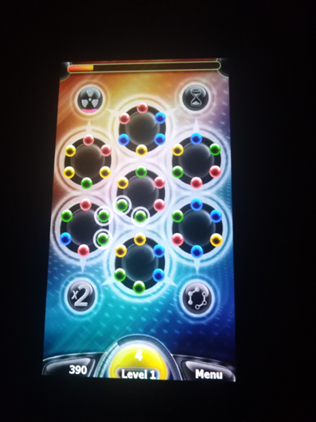
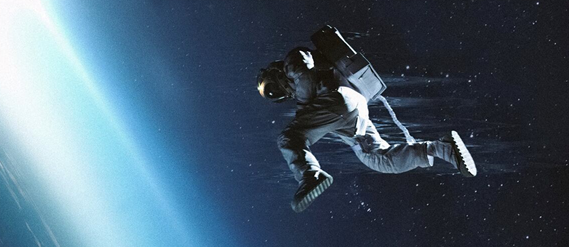

# Spinballs 1.1 -- main branch

## Preface
I found veery Spinballs old theme on 4PDA site. I tried that oldie, but game don't want to run. So, I decide(d) to do some little micro-RnD. :) 

## Game scenario 
- The game consists of seven discs, with six color balls. Each disk can rotate in both directions. You need to collect one whole ball from the same side balls and it will disappear, and you will get points for it. But do not forget about the running time.

## Screenshots

## Status of RnD

- Init state (however, game runs at least!)))

## Tech details
- UWP app (micro-game)
- Min. Win. SDK used: 10240 (Astoria compatibility)
- Monogame "engine" used
- VSCode/KiloCode's Qwen-3 AI used for simple gamedev "recovering" 

## Task List
- [ ] Fix game cotro (tune touch mode, add mouse mode)
- [ ] Fix game scaling
- [ ] Check sound / music theme

## TODO / Current Goal
- Fix accelerometer / gyroscope
- Polish and test final gameplay experience (add some coins, score, lives, wall breaks, etc... )

## Reference
- https://4pda.to/forum/index.php?showtopic=218315

## ..
As is. No support. Just for fun! DIY.

## .
[m][e] Nov, 22 2025

