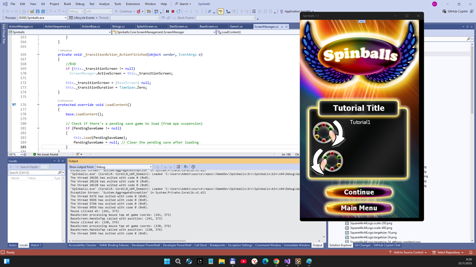
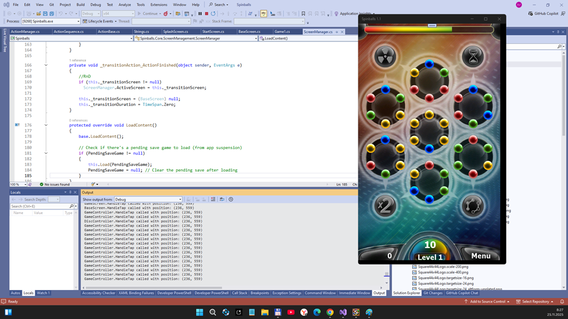
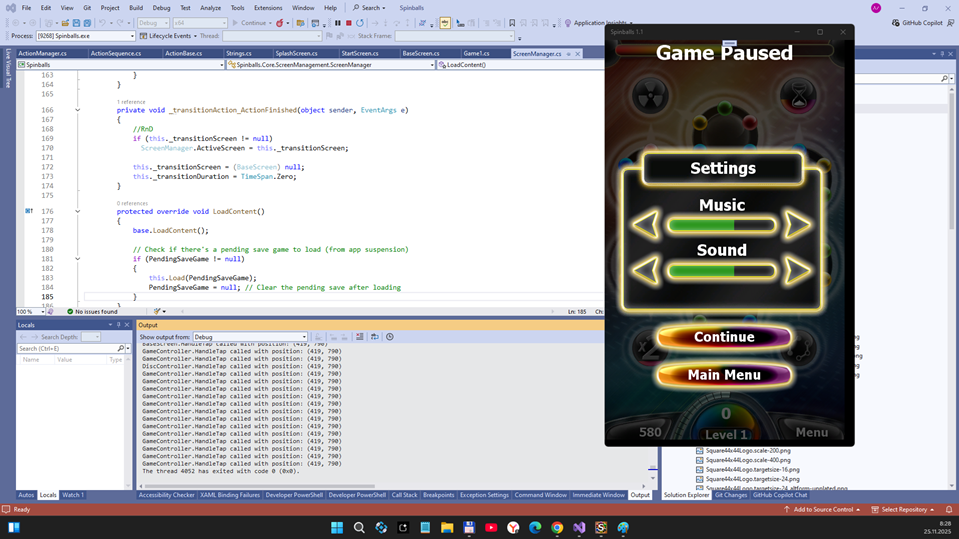

# Spinballs 1.1 -- dev branch

## Preface
I found veery Spinballs old theme on 4PDA site. I tried that oldie, but game don't want to run. So, I decide(d) to do some little micro-RnD. :) 

## Game scenario 
- The game consists of seven discs, with six color balls. Each disk can rotate in both directions. You need to collect one whole ball from the same side balls and it will disappear, and you will get points for it. But do not forget about the running time.

## Screenshots

## Status of RnD
- PC: game runs ok... but no game-screen autoscaling after window resize
- Lumia 950 smartphone: no touch support (coordinate transfer problems?), and no screen autoscaling  
- Game save/load damaged
- Temporary game over blocked by me (for game debug simplify.) 
- Language strings ot ready (only tech. words at now)

## Tech details
- UWP app (micro-game)
- Min. Win. SDK used: 10240 (Astoria compatibility)
- Monogame "engine" used
- VSCode/KiloCode's Qwen-3 AI used for simple gamedev "recovering" 

## Main Tasks realized
- [+-] Fix game controls (tune touch mode, add mouse mode)
- [+] Check sound / music theme
- [+-] Fix screen mode switching (Settings mode needs more testing!)

## TODO / Current Goal
- Fix screen auto-scaling
- Fix touch game control
- Fix English game phrases & add Russian localization
- Polish and test final gameplay experience (add some coins, score, lives, wall breaks, etc... ) [optional, of cause - DIY]

## Reference
- https://4pda.to/forum/index.php?showtopic=218315

## ..
As is. No support. Educational purposes only / Retro-Coding in pair with AI. Just-for-funnn! 

## .
[m][e] Nov, 25 2025

